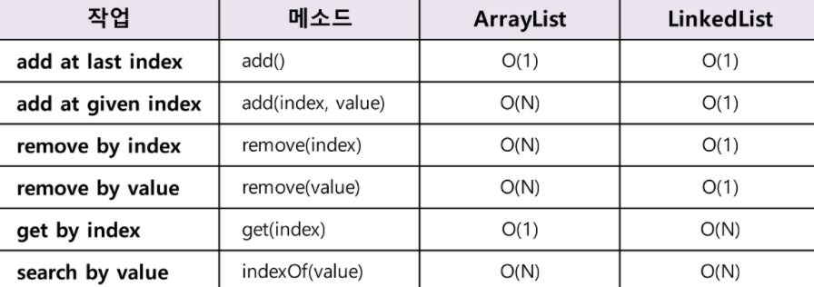

# 🔣 알고리즘 : BFS (Breadth First Search)

DFS(Depth First Search)와 구분되는 탐색법 중 하나로, 선택한 노드의 인접한 노드를 먼저 탐색하는 전략이다. 
탐색법 중에서도 시간이 조금 걸리더라도 어쨌든 모든 경우를 탐색해봐야하는 경우에 자주 사용된다. 
최단 거리 찾기, 최단 시간(토마토 문제) 도출 등에 사용된다.  

반대로, DFS는 일단 빨리 길(목적노드)을 찾는게 우선인 경우에 사용

## ❗ 알고리즘

7576번 토마토 문제에서 높이가 추가된 특별할 것 없는 BFS 문제였다. 
~~특별할 것 없다는 것이 쉽다는 걸 의미하진 않지만...~~  

boolean Table을 작성하는 것 대신 queue에 객체를 집어넣는 경우를 bfs 했을 때 익을 토마토를 넣는 방식으로 작성했다. 
queue에 들어간다는 이야기는 이번 날짜에 익을(다음 날짜에 다른 토마토를 익힐) 토마토를 집어넣는 것.  

모든 direction 을 살펴보면서 조건에 부합하는 노드들은 바로바로 queue에 넣고, 날짜는 기존 익은 토마토 값 + 1 로 처리했다.

## ❗ 알고리즘 외

Queue의 구현체는 LinkedList  이다. Queue<E> queue = new LinkedList<>()  
그 이유는 Queue 에서 요구하는 기능을 살펴보면 되는데, 기본적으로 Queue는 선입 선출의 양 극단의 데이터 삭제/추가의 기능을 수행한다. 
아래의 표를 보면 데이터의 추가 삭제는 LinkedList 가 압도적으로 빠르다. 

 
그도 그럴 것이 LinkedList 는 크기가 정해져있지않기 때문에 데이터를 계속 추가해나가는 데에 아무런 제약이없다. 
반면 ArrayList 는 우리가 사용할 때 크기가 동적으로 변한다고 착각하기 쉬운데, 사실 내부적으로 크기가 동적으로 변하는 것 처럼 새로운 배열을 만들어서 값을 복사해나가는
다소 비효율적인 절차를 거친다. 

따라서 데이터 추가/삭제에 유리한 LinkedList 를 사용하는 것이 Queue 구조에 유리하다. 

## 🙂 정리

Direction 을 표현하는 법(방향만큼 배열 크기를 잡을지/+1, -1만 두고 조건을 잡을지) 
Boolean Table 을 쓸지, 다른 방식으로 조건을 처리할지 생각해낼 수 있는 능력이 중요한 것 같다.  

