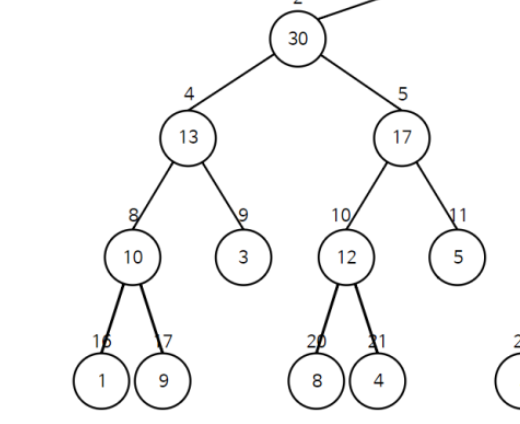

# 🔣 알고리즘 : Segment Tree

연속적인 데이터의 합을 구할 때 유용한 트리인 Segment Tree 
배열의 구조로 특정 범위의 데이터의 합을 구하기 위해서는 시간 복잡도가 O(N) 이 나온다. 반대로 Segment Tree 같은 경우에는 노드값 자체가 연속적인 데이터의 합이기 때문에  트리 탐색 시간 복잡도인 O(logN)가 나온다.  
Segment Tree 는 각 노드 값이 자식노드의 합으로 이루어지고, leaf node 가 연속된 데이터들의 값으로 이루어진다.  
이렇게 형성된 Tree의 모양을 살펴보면 아래와 같다.  
가령 2~5의 연속된 데이터의 합을 구하고자 한다면, 4번 10번 노드의 합을 구하면 된다.  (17,9,20,21,11 리프노드가 각각 2,3~~5번 배열값을 의미) 
탐색법 및 수정법은 코드파일 참고! 

## ❗ 알고리즘

Segment Tree 는 기본적인 트리를 생성하는 순서를 따른다. 다만 노드 값이 연속적인 데이터의 합으로 결정된다. 
그렇기 때문에 노드의 값은 node(n) = sum(n left child) + sum(n right child) 와 같은 방식으로 재귀적으로 구현한다. 
update 같은 경우에는 target 이 노드의 범위안에 드느냐에 따라서 노드 값에 diff 를 더해준다. 

## ❗ 알고리즘 외

parseInt 는 String value 를 int 의 primitive type 으로 변경해준다. 
valueOf 는 String value 를 Integer 의 Reference type 으로 변경해준다. 
하지만 valueOf 는 사실 내부적으로 parseInt 를 사용한다.()

## 🙂 정리

연속적인 데이터의 합 Segment Tree 
트리를 작성해야겠다고 생각이 들 때 간략한 그림을 그려볼 것 
좌측 자식(nx2) / 우측 자식(nx2+1) 
 
