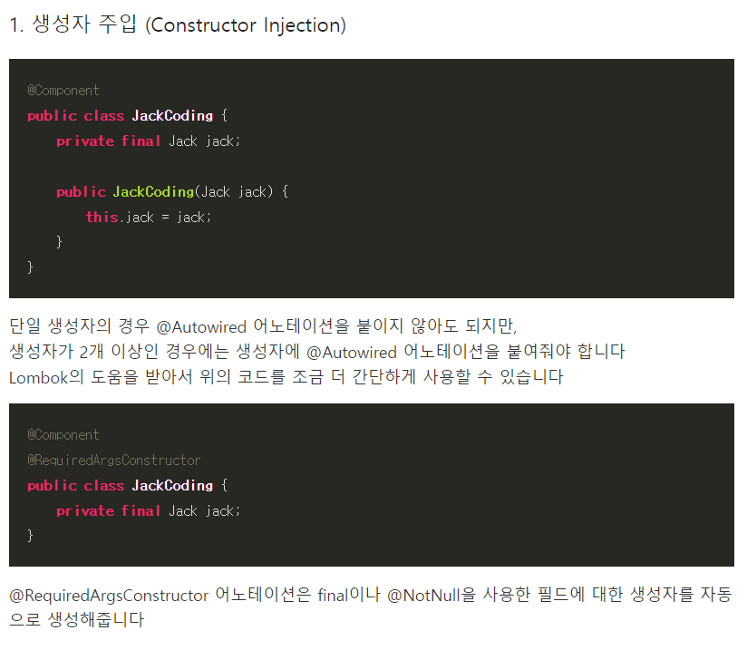

<br>
필드 주입, 수정자 주입은 객체 생성 시점에 DI 가 일어나지 않는다. 즉 의존성 주입이 필요한 필드를 안고있는 객체가 생성된 후에 필드에 있는 변수에 주입이 일어난다. 즉 먼저 빈을 생성한 후에 주입하려는 빈을 찾아서 주입한다<br><br>
반대로 생성자 주입은 주입하려는 빈을 먼저 찾는다<br>
```
class Sample {
    Aclass ac;
    
    가령 Aclass 가 Sample 과 순환참조를 하고 있다면(메소드 내부에 쓰이려면 어쩔 수 없이 순환참조를 하고있다)
    컴파일 과정에서 순환참조 오류를 발견해낸다
    @Autowired --> 객체 생성 시점에 빈을 생성하지 않고 인자에 해당하는 Aclass 빈을 찾으러 간다
    Sample (Aclass ac) {
    }
    
}
```

