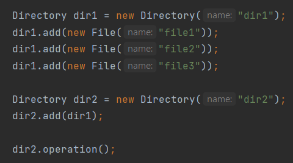
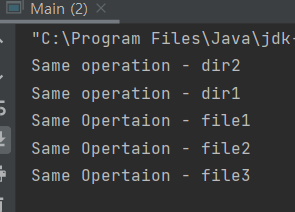

# Composite

단일 객체와 복합 객체(Singe / Group) 의 기능이 유사할 때 사용할 수 있는 패턴 
Component 라는 공통성을 띄는 행동(operation) 을 정의하고 이를 구현한 객체를 만드는 방식 
보통 File - Directory 구조에서 사용된다.  

본 코드에서는 Directory 와 File 의 구조를 표현했으며 Dir 의 operation 이 동작하면, 
Dir 을 포함한 자식들 또한 동일한 동작을 수행하는 구조이다. 
보편적으로 부모 Directory 의 경로를 수정하면 자식 File 및 DIR 또한 경로가 수정되는 것이 그 예 이다.  

아래는 해당 로직을 구현하고 실행한 결과이다. 동일한 operation 을 수행하는 것을 확인할 수 있다.

